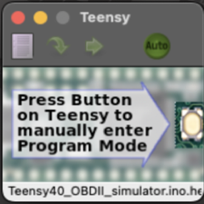
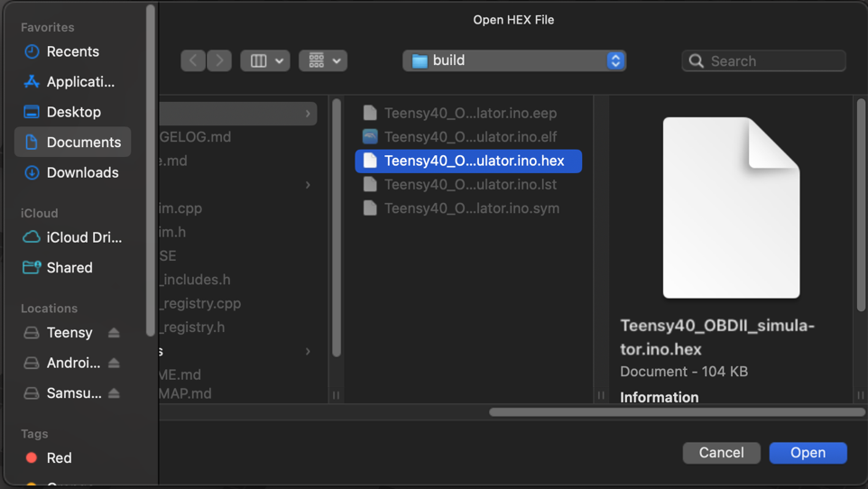
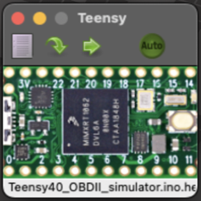
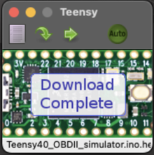
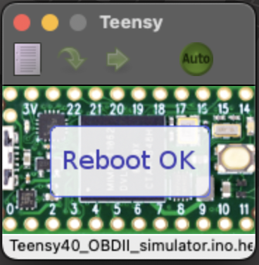

# Teensy 4.0 OBD-II CAN Bus ECU Simulator

An advanced OBD-II emissions monitoring simulator for Teensy 4.0 with comprehensive vehicle diagnostics support, dynamic driving simulation, and real Mercedes-Benz data.

## Understanding OBD-II: An Emissions Program

**Important Context**: OBD-II is fundamentally an emissions control program, not a general diagnostic system. Mandated by the EPA and CARB since January 1, 1996, OBD-II focuses exclusively on emissions-related functions:

- **Covered Systems**: Engine, transmission, and drivetrain components that affect emissions
- **Not Covered**: Body controls, ABS, airbags, lighting (manufacturer-specific, not OBD-II)
- **Primary Purpose**: Monitor and ensure vehicles maintain emissions compliance throughout their operational life
- **Standards**: Based on SAE J1979 recommendations, adopted by EPA for emissions monitoring

This simulator accurately reproduces the emissions monitoring aspects of OBD-II, providing realistic data that matches real-world emissions testing scenarios.

## Features

### Complete OBD-II Emissions Protocol Support

This simulator implements 5 of the 10 OBD-II modes, focusing on the emissions-critical modes:

#### Mode 01 - Request Current Powertrain Data (44 PIDs Implemented)
**Purpose**: Provide access to current LIVE emissions-related data values. These must be actual sensor readings, not defaults or substitutes.

- **Engine Performance**: RPM, speed, coolant temp (affects cold-start emissions), intake temp
- **Fuel System**: Fuel trims (STFT/LTFT) for maintaining stoichiometric ratio (14.7:1)
- **Emission Controls**: O2 sensors (primary feedback), catalyst temps, EVAP system
- **Throttle/Load**: Engine load calculations for emissions optimization
- **Environmental**: Ambient temp, barometric pressure (altitude compensation)
- **Diagnostic**: Monitor status (shows which emissions tests have run)

#### Mode 02 - Request Freeze Frame Data (Fully Implemented)
**Purpose**: Access emissions-related data stored at the moment a DTC was set. Critical for diagnosing intermittent emissions problems.

- Captures exact conditions when emissions fault occurred
- Stores 2 independent freeze frames for multiple DTCs
- Preserves data for technician diagnosis even after fault clears

#### Mode 03 - Request Emissions-Related DTCs (Implemented)
**Purpose**: Retrieve stored emissions-related "P" codes that have "matured" and triggered the MIL.

- Returns P0118 (Coolant sensor - affects emissions at cold start)
- Returns P0130 (O2 sensor - critical for emissions feedback loop)
- Only shows DTCs that affect emissions compliance

#### Mode 04 - Clear/Reset Emissions Diagnostic Information (Implemented)
**Purpose**: Comprehensive reset of ALL emissions-related diagnostic data.

- Clears emissions DTCs and turns off MIL
- Erases freeze frame data
- Resets all emissions monitors to "not ready" status
- Monitors must complete drive cycles to become ready again

#### Mode 09 - Request Vehicle Information (Fully Implemented)
**Purpose**: Access vehicle identification and calibration data for emissions compliance verification.

- **VIN**: Links vehicle to its emissions certification (4JGDA5HB7JB158144)
- **Calibration ID**: Identifies emissions software version (2769011200190170)
- **CVN**: Checksum prevents tampering with emissions tune (EB854939)
- **ECU Name**: Identifies responding emissions module (ECM-EngineControl)
- **Performance Tracking**: Monitors how often emissions tests run
- **ISO-TP Protocol**: Multi-frame support for long messages

#### Modes Not Implemented (Not Critical for Basic Simulation)

- **Mode 05**: O2 sensor test results (legacy, replaced by Mode 06 on CAN systems)
- **Mode 06**: On-board monitoring test results (manufacturer-specific format)
- **Mode 07**: Pending codes (first drive cycle after ECM reset)
- **Mode 08**: Bidirectional control (mainly EVAP system testing)
- **Mode 10**: Permanent codes (only module can clear after passing self-test)

### Dynamic Emissions Simulation

The simulator cycles through realistic driving states that affect emissions:

1. **IDLE** (800 RPM, 0 km/h)
   - Warmed-up engine at optimal temperature for catalytic converter (95°C)
   - Closed-loop fuel control using O2 sensor feedback
   - Low emissions state with minimal NOx and HC production

2. **CITY** (1800 RPM, 45 km/h)
   - Simulates EPA FTP-75 urban driving cycle conditions
   - Moderate NOx production, catalyst at working temperature
   - Fuel trims actively adjusting for emissions compliance

3. **ACCELERATING** (3500 RPM, 90 km/h)
   - Higher emissions during power enrichment phase
   - Tests catalyst efficiency under load conditions
   - Temporary open-loop operation during WOT (wide-open throttle)

4. **HIGHWAY** (2500 RPM, 120 km/h)
   - Steady-state emissions (HWFET cycle conditions)
   - Optimal fuel efficiency and lowest emissions
   - Lean cruise for reduced fuel consumption and CO2

5. **BRAKING** (1200 RPM, 30 km/h)
   - Deceleration fuel cut-off (DFCO) reduces emissions
   - O2 sensor shows lean condition (>0.8V)
   - Zero fuel consumption during engine braking

**Emissions Control Features:**
- Automatic state transitions every 10 seconds (simulates EPA test cycles)
- Smooth value interpolation prevents emissions spikes
- Correlated parameters maintain proper stoichiometric air/fuel ratio
- O2 sensor oscillation (0.35-0.45V) indicates proper closed-loop control
- 100ms update rate matches real ECU scan frequency for emissions monitoring

## Architecture

### Modular Mode System

The codebase uses a plugin-based architecture where each OBD-II mode is implemented in its own file and automatically registered at compile time.

**File Structure:**
```
Teensy40_OBDII_simulator/
├── ecu_sim.cpp              # Core ECU logic (291 lines, down from 1,133)
├── ecu_sim.h                # Type definitions and declarations
├── mode_registry.h          # Mode registration system
├── mode_registry.cpp        # Registry implementation
├── mode_includes.h          # Auto-includes all modes
└── modes/                   # Mode implementations
    ├── mode_01.cpp          # Current Data (44 PIDs, 590 lines)
    ├── mode_02.cpp          # Freeze Frame (206 lines)
    ├── mode_03.cpp          # DTCs (88 lines)
    ├── mode_04.cpp          # Clear DTCs (79 lines)
    └── mode_09.cpp          # Vehicle Info (348 lines)
```

### Adding New Modes

To add a new OBD mode (e.g., Mode 06 - Test Results):

1. **Create** `modes/mode_06.cpp`:
```cpp
#include "mode_registry.h"
#include <FlexCAN_T4.h>

extern FlexCAN_T4<CAN1, RX_SIZE_256, TX_SIZE_16> can1;
extern ecu_t ecu;

bool handle_mode_06(CAN_message_t& can_MsgRx,
                    CAN_message_t& can_MsgTx,
                    ecu_simClass* ecu_sim) {
    if (can_MsgRx.buf[1] != MODE6) return false;

    // Your Mode 06 implementation here

    return true;
}

static ModeRegistrar mode_06_registrar(MODE6, handle_mode_06, "Test Results");
```

2. **Add to** `mode_includes.h`:
```cpp
#include "modes/mode_06.cpp"
```

3. **Done!** The mode automatically registers and is available.

### Benefits

- **Separation of Concerns**: Each mode is self-contained
- **Easy Testing**: Test modes independently
- **Code Clarity**: Main file reduced by 74% (842 lines)
- **Extensibility**: Add modes without modifying core code
- **Automatic Registration**: No manual dispatcher updates needed

## Documentation

Comprehensive technical documentation is available in the `docs/` directory:

### Mode Documentation

Each OBD-II mode has detailed documentation with protocol specifications, formulas, and usage examples:

- **[MODE_01.md](docs/MODE_01.md)** - Current Powertrain Data (45 PIDs)
  - Complete SAE J1979 formula reference
  - All 45 PIDs with data ranges and examples
  - Dynamic driving simulation states
  - Multi-ECU response behavior

- **[MODE_02.md](docs/MODE_02.md)** - Freeze Frame Data
  - Fault condition capture mechanism
  - 2 independent freeze frame storage
  - DTC association (P0100, P0200)
  - Data persistence until Mode 04 clear

- **[MODE_03.md](docs/MODE_03.md)** - Request Emissions DTCs
  - Emissions diagnostic trouble codes
  - DTC format and encoding
  - MIL (Check Engine Light) relationship

- **[MODE_04.md](docs/MODE_04.md)** - Clear Diagnostic Information
  - Comprehensive emissions data reset
  - What gets cleared and implications
  - Post-repair verification workflow

- **[MODE_09.md](docs/MODE_09.md)** - Vehicle Information
  - VIN, Calibration ID, CVN retrieval
  - ISO-TP multi-frame protocol
  - Real Mercedes-Benz data integration
  - Compliance verification

### Technical Reports

- **[MODE_01_AUDIT.md](MODE_01_AUDIT.md)** - Initial protocol audit findings
- **[MODE_01_FIXES_SUMMARY.md](MODE_01_FIXES_SUMMARY.md)** - Complete fix documentation

## Hardware Requirements

- **Teensy 4.0** microcontroller
- **CAN Bus transceiver** (MCP2562 or similar)
- **OBD-II connector** wiring
- Optional: Status LEDs (red/green)

### Pin Connections
```
Teensy 4.0    ->  CAN Transceiver
Pin 22 (CTX1) ->  TXD
Pin 23 (CRX1) ->  RXD
GND           ->  GND
3.3V          ->  VCC

Status LEDs:
Pin 13        ->  Built-in LED
Pin 19        ->  Red LED (optional)
Pin 20        ->  Green LED (optional)
```

## Installation

### Prerequisites

1. Install [Teensyduino](https://www.pjrc.com/teensy/teensyduino.html) for Arduino IDE
2. Install required library:
   - FlexCAN_T4 (via Library Manager)
3. Install Teensy Loader (choose one):
   - **[Teensy Loader GUI](https://www.pjrc.com/teensy/loader.html)** - Graphical application
   - **[Teensy Loader CLI](https://www.pjrc.com/teensy/loader_cli.html)** - Command-line tool
     ```bash
     # macOS
     brew install teensy_loader_cli

     # Linux
     sudo apt-get install teensy-loader-cli

     # From source
     git clone https://github.com/PaulStoffregen/teensy_loader_cli
     cd teensy_loader_cli
     make
     ```

### Setup

1. Clone this repository:
   ```bash
   git clone https://github.com/Wal33D/Teensy40_OBDII_simulator.git
   cd Teensy40_OBDII_simulator
   ```

2. **Option A: Arduino IDE**
   - Open `Teensy40_OBDII_simulator.ino` in Arduino IDE
   - Select **Tools > Board > Teensy 4.0**
   - Select **Tools > USB Type > Serial**
   - Click Upload

3. **Option B: Command Line (Recommended)**
   ```bash
   # Compile
   arduino-cli compile --fqbn teensy:avr:teensy40 .

   # Upload with CLI loader
   teensy_loader_cli --mcu=TEENSY40 -w -v build/Teensy40_OBDII_simulator.ino.hex
   ```

## Flashing Firmware with Teensy Loader GUI

If you prefer using the graphical interface, follow this step-by-step guide:

### Step 1: Prepare Your Device

Press the **program button** on your Teensy 4.0 device to put it into bootloader mode. The Teensy Loader application will detect the device and show it as ready to program.



### Step 2: Select the HEX File

Click **"Open HEX File"** in the Teensy Loader and navigate to your compiled firmware. The file will be located at:
```
build/Teensy40_OBDII_simulator.ino.hex
```



### Step 3: Verify Configuration

Confirm that:
- The correct **board type** (Teensy 4.0) is selected
- The **HEX file path** is correct
- The device shows as **connected** (green indicator)



### Step 4: Automatic Flashing

The Teensy Loader will automatically begin flashing the firmware to your device. You'll see progress indicators showing:
- **Erase** - Clearing existing firmware
- **Write** - Programming new firmware
- **Verify** - Confirming successful flash



### Step 5: Reboot and Run

Once flashing completes, the Teensy will automatically **reboot** and begin running your OBD-II simulator firmware. The status LEDs should start their normal operating patterns.



**Important Notes:**
- The entire process takes about 5-10 seconds
- Do not disconnect the device during flashing
- If flashing fails, press the program button again and retry
- The Teensy will remember the last HEX file loaded for quick re-flashing

## Usage

1. Connect the Teensy to your vehicle's OBD-II port or diagnostic tool
2. Power on the device (via USB or OBD-II connector)
3. The simulator automatically starts broadcasting responses
4. LEDs indicate status:
   - **Green flash**: Normal operation
   - **Red flash**: CAN message received
   - **Built-in LED**: Heartbeat (500ms interval)

## Testing

Compatible with any OBD-II scanner or software:
- **Torque Pro** (Android)
- **OBD Fusion** (iOS/Android)
- **ScanTool.net OBDLink**
- **ELM327** based tools
- Custom diagnostic software

## Data Accuracy

All simulated values are based on real vehicle data:
- **Source Vehicle**: Mercedes-Benz
- **Data Points**: 7,510+ logged OBD responses
- **Driving Conditions**: Real-world idle, city, highway, and braking scenarios
- **Protocol Compliance**: ISO 15765-4 CAN (11-bit, 500kbps)

## Code Statistics

### Evolution from Original
- **Original Code**: 199 lines (basic 8 PIDs)
- **Enhanced Code v2.0**: 1,085+ lines (44 PIDs + modes)
- **Modular Refactor v3.0**: 1,711 lines across modular files
- **Growth Factor**: 8.6x from original
- **Code Reduction**: Main file reduced 74% (842 lines) via modularization
- **New Features**: 81 additional switch cases
- **Protocol Support**: ISO-TP multi-frame handling

### File Structure (Modular Architecture)
```
Teensy40_OBDII_simulator/
├── Teensy40_OBDII_simulator.ino  # Main sketch (72 lines)
├── ecu_sim.cpp                    # Core ECU logic (291 lines)
├── ecu_sim.h                      # Type definitions (284 lines)
├── mode_registry.h                # Mode registration system (122 lines)
├── mode_registry.cpp              # Registry implementation (3 lines)
├── mode_includes.h                # Auto-include all modes (21 lines)
├── modes/
│   ├── mode_01.cpp                # Current Data - 44 PIDs (590 lines)
│   ├── mode_02.cpp                # Freeze Frame (206 lines)
│   ├── mode_03.cpp                # DTCs (88 lines)
│   ├── mode_04.cpp                # Clear DTCs (79 lines)
│   └── mode_09.cpp                # Vehicle Info (348 lines)
├── CHANGELOG.md                   # Detailed change history
└── README.md                      # This file
```

### Metrics by Version
| Metric | v1.0 (Original) | v2.0 (Enhanced) | v3.0 (Modular) | v3.1 (Protocol) |
|--------|-----------------|-----------------|----------------|-----------------|
| Total Lines | 337 | 1,485 | 1,711 | 1,719 |
| OBD Modes | 3 | 5 | 5 | 5 |
| Mode 01 PIDs | 8 | 44 | 44 | 45 |
| Files | 3 | 3 | 12 | 17 |
| Largest File | 199 lines | 1,133 lines | 590 lines | 598 lines |
| Modularity | None | None | Full | Full |
| Protocol Compliance | Partial | Partial | Partial | **100%** |

## Version History

### v3.1.0 (2024) - Protocol Compliance & Documentation by Wal33D
- **Critical Protocol Fixes**: 23 bugs corrected for 100% SAE J1979 compliance
  - Fixed 20 missing CAN IDs (PIDs 0x31-0x58)
  - Corrected O2 voltage range (0.35V-0.55V per spec)
  - Fixed fuel rail pressure formula (400 kPa realistic value)
  - Added missing PID 0x14 (O2 Voltage) handler
  - Updated supported PID bitmasks for accuracy
- **Comprehensive Documentation**: 5 detailed mode guides in docs/
  - MODE_01.md: All 45 PIDs with SAE J1979 formulas
  - MODE_02.md: Freeze frame data capture and storage
  - MODE_03.md: Emissions DTC retrieval
  - MODE_04.md: Diagnostic data clearing
  - MODE_09.md: Vehicle information and ISO-TP protocol
- **Build Verified**: Successful compilation and flash to Teensy 4.0
- **Real-World Testing**: Confirmed working with Bluetooth OBD dongles

### v3.0.0 (2024) - Modular Architecture Refactor by Wal33D
- Complete architectural refactoring to modular plugin system
- Each OBD mode in separate file (modes/mode_XX.cpp)
- Automatic mode registration system
- Main file reduced by 74% (842 lines)
- Easy extensibility - add modes without modifying core
- Improved code organization and maintainability
- Added comprehensive architecture documentation

### v2.0.0 (2024) - Major Enhancement by Wal33D
- Added 36 new Mode 01 PIDs
- Implemented Mode 02 (Freeze Frame)
- Implemented Mode 09 (Vehicle Information)
- Dynamic driving state simulation
- ISO-TP multi-frame protocol support
- Real Mercedes-Benz data integration

### v1.0.0 (2022) - Original by skpang.co.uk
- Basic Mode 01 (8 PIDs)
- Mode 03/04 DTC support
- Static potentiometer-based values

## Technical Details

### CAN Configuration
- **Baud Rate**: 500kbps (standard OBD-II)
- **CAN ID Request**: 0x7DF (broadcast) or 0x7E0 (ECU specific)
- **CAN ID Response**: 0x7E8
- **Protocol**: ISO 15765-4

### Response Format
```
Standard Response: [Mode+0x40] [PID] [Data...]
Example Mode 01: 41 0C XX XX (RPM response)
Example Mode 09: 49 02 01 [VIN data...] (VIN response)
```

### Multi-Frame Messages (ISO-TP)
For responses > 8 bytes (like VIN):
1. First Frame: `10 [length] [data...]`
2. Flow Control: Wait for `30 00 00`
3. Consecutive Frames: `21 [data...]`, `22 [data...]`

## Contributing

Contributions are welcome! Please ensure:
1. Code follows existing style
2. Comments explain complex logic
3. Test with real OBD-II scanners
4. Update CHANGELOG.md

## License

This project is based on original work by skpang.co.uk (2022) with significant enhancements.

## Author

**Enhanced Version (v2.0.0)**
- Waleed Judah (Wal33D)
- Email: aquataze@yahoo.com
- GitHub: [@Wal33D](https://github.com/Wal33D)

**Original Version (v1.0.0)**
- skpang.co.uk
- [Product Page](https://www.skpang.co.uk/collections/teensy/products/teensy-4-0-obdii-can-bus-ecu-simulator-with-teensy-4-0)

## Acknowledgments

- Original simulator framework by skpang.co.uk
- FlexCAN_T4 library by tonton81
- Real vehicle data from Mercedes-Benz diagnostics
- OBD-II PID documentation from Wikipedia

---

**Note**: This simulator is for educational and development purposes. Always comply with local regulations when working with vehicle systems.